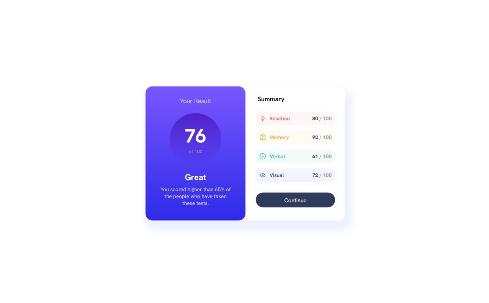
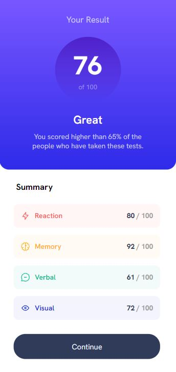

# Frontend Mentor - Results summary component solution

This is a solution to the [Results summary component challenge on Frontend Mentor](https://www.frontendmentor.io/challenges/results-summary-component-CE_K6s0maV). Frontend Mentor challenges help you improve your coding skills by building realistic projects. 

## Table of contents

- [Overview](#overview)
  - [The challenge](#the-challenge)
  - [Screenshot](#screenshot)
  - [Links](#links)
- [My process](#my-process)
  - [Built with](#built-with)
  - [Useful resources](#useful-resources)
- [Author](#author)

## Overview

### The challenge

Users should be able to:

- View the optimal layout for the interface depending on their device's screen size
- See hover and focus states for all interactive elements on the page

### Screenshot
Desktop design

Mobile design

### Links

- Solution URL: [Git](https://github.com/ania-sk/results-summary)
- Live Site URL: [Results summary](https://ania-sk.github.io/results-summary/)

## My process

### Built with

- Semantic HTML5 markup
- CSS custom properties
- Flexbox

### Useful resources

- [Box shadow](https://developer.mozilla.org/en-US/docs/Web/CSS/box-shadow) - This helped me understand how to set box-shadow.
- [HSL Color Picker](https://hslpicker.com/) - This website helped me change color format.

## Author

- Website - [ania-sk](https://github.com/ania-sk)
- Frontend Mentor - [@ania-sk](https://www.frontendmentor.io/profile/ania-sk)

